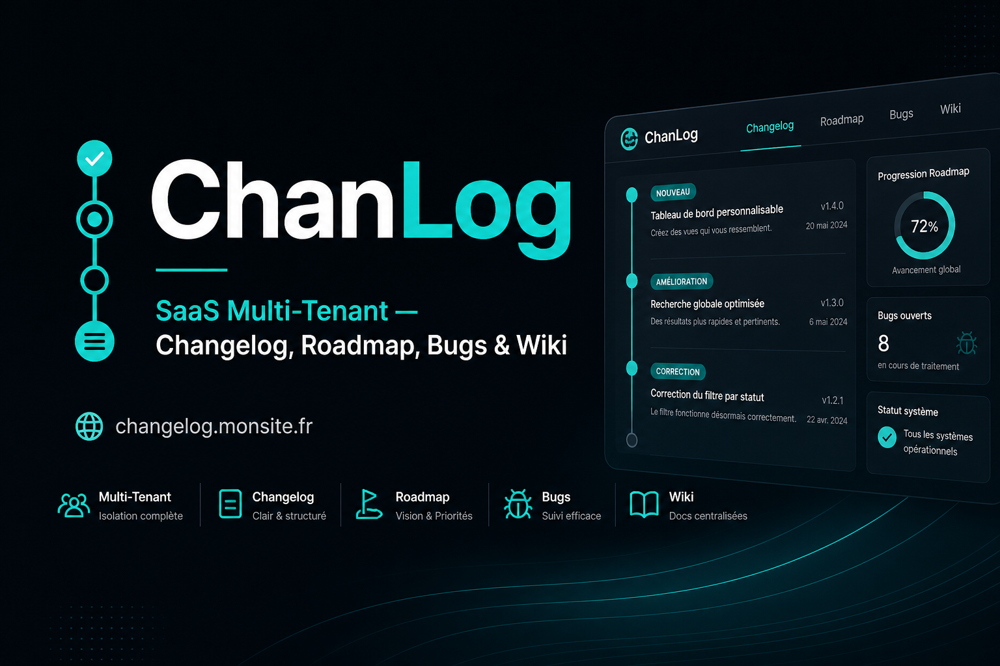
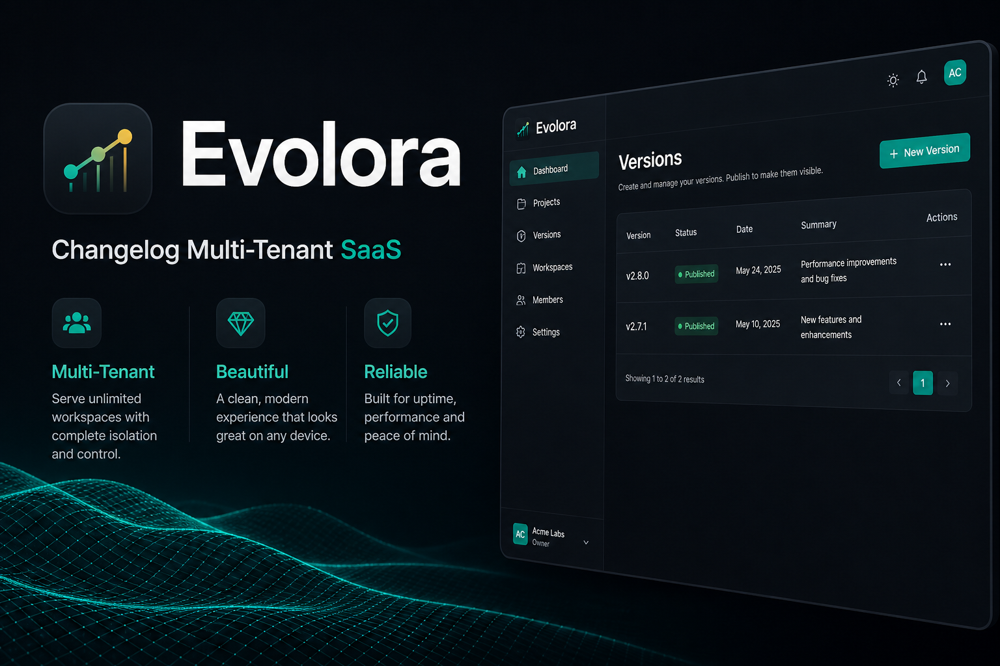
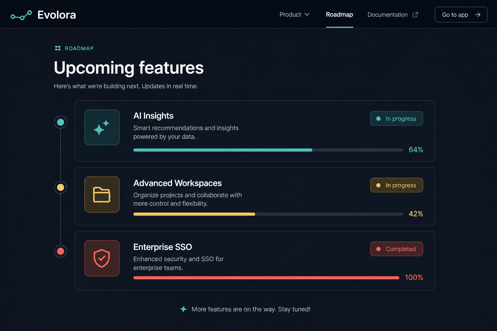
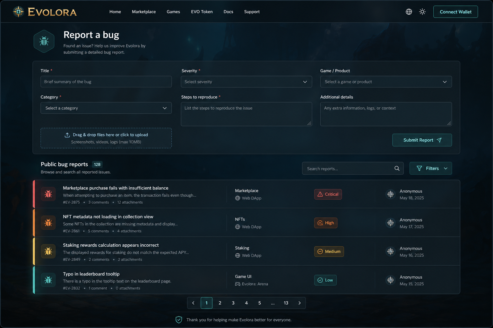
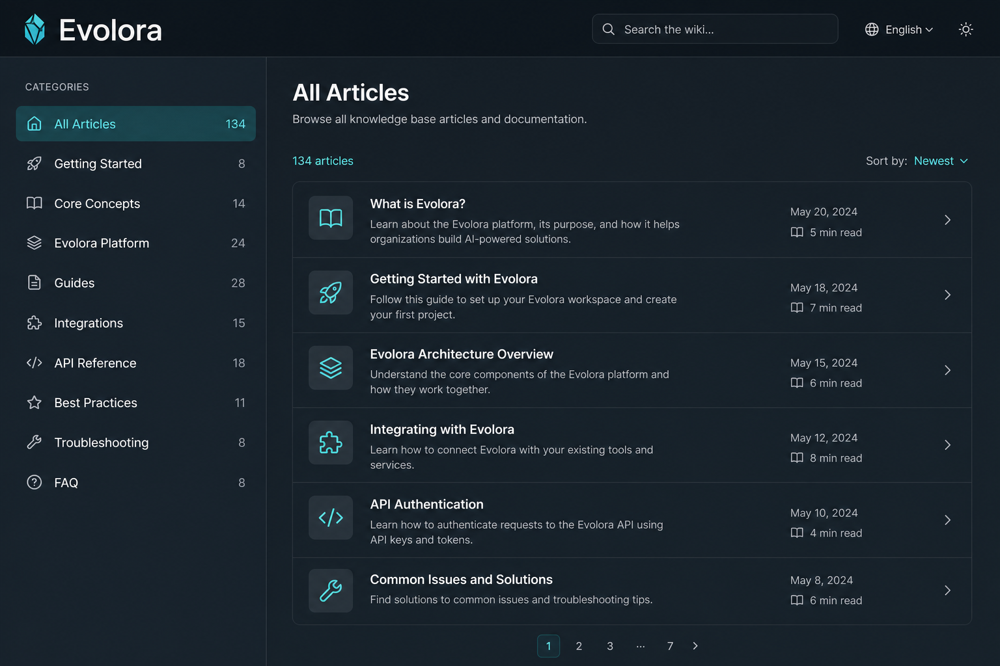
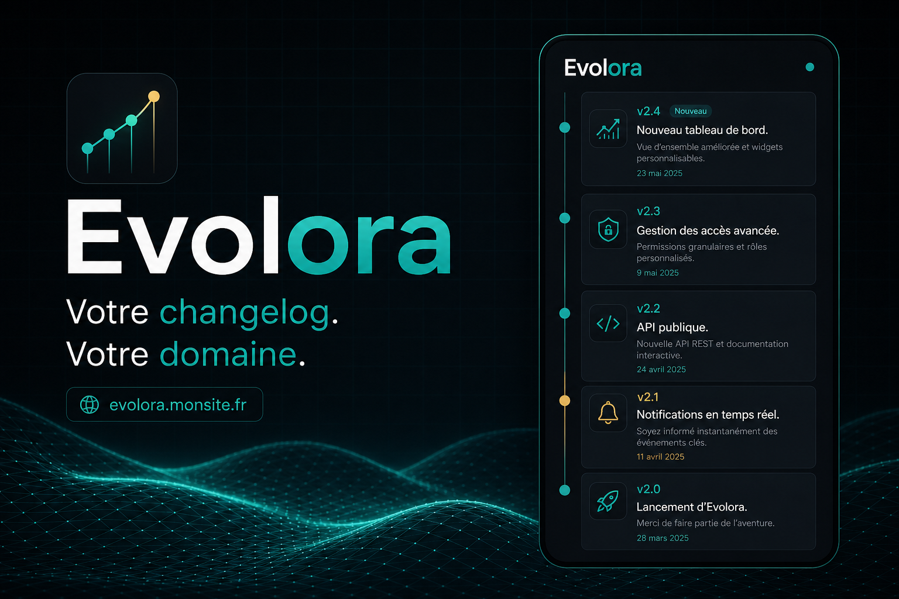

<p align="center">
  
</p>

<p align="center">
  
</p>

# Evolora

<p align="center">
  <strong>SaaS multi-tenant</strong> — Changelog · Roadmap · Bugs · Wiki<br/>
  <code>changelog.monsite.fr</code>
</p>

## À propos d’Evolora

**Evolora** est une application web Laravel pour publier les versions d’un produit : changelog, roadmap, signalement de bugs et wiki, dans un espace public à votre marque.

Chaque compte client peut créer son propre espace sous un sous-domaine (`slug.votredomaine.fr`) ou un domaine personnalisé.

**Identité visuelle :** `logo.png`, `logo.svg`, `icon.svg`, `assets/logo/`, `Promo/`

## Prérequis

- PHP 8.2 ou supérieur
- Composer
- MySQL 5.7 ou supérieur
- Node.js et NPM (pour les assets frontend)

## Installation

1. Clonez le dépôt
   ```
   git clone <url-du-dépôt>
   cd projet_laravel
   ```

2. Installez les dépendances PHP
   ```
   composer install
   ```

3. Installez les dépendances JavaScript
   ```
   npm install
   npm run dev
   ```

4. Copiez le fichier d'environnement et générez la clé d'application
   ```
   cp .env.example .env
   php artisan key:generate
   ```

5. Configurez la base de données dans le fichier .env

## Configuration de la base de données

Les informations de connexion à la base de données sont configurées dans le fichier `.env` à la racine du projet. Voici les paramètres actuels :

```

DB_CONNECTION=mysql
DB_HOST=127.0.0.1
DB_PORT=3306
DB_DATABASE=laravel
DB_USERNAME=laravel
DB_PASSWORD=Laravel

```

### Explication des paramètres

- **DB_CONNECTION** : Type de base de données (mysql, sqlite, pgsql, sqlsrv)
- **DB_HOST** : Adresse du serveur de base de données (localhost ou 127.0.0.1 pour un serveur local)
- **DB_PORT** : Port de connexion à la base de données (3306 par défaut pour MySQL)
- **DB_DATABASE** : Nom de la base de données
- **DB_USERNAME** : Nom d'utilisateur pour se connecter à la base de données
- **DB_PASSWORD** : Mot de passe pour se connecter à la base de données

## Migration et seeding

Pour créer les tables dans la base de données et les remplir avec des données de test :

```
php artisan migrate
php artisan db:seed
```

## Lancement de l'application

Pour démarrer le serveur de développement :

```
php artisan serve
```

L'application sera accessible à l'adresse http://127.0.0.1:8000

## Fonctionnalités principales

- Gestion des versions (changelog) avec support des images
- Suivi des rapports de bugs avec système de progression et statuts colorés
- Liste de tâches (todo) avec gestion des priorités
- Gestion de pages de contenu dynamique
- Système de wiki avec catégories et articles
- Interface d'administration complète
- Thème sombre/clair
- Gestion des paramètres système

## Structure de la base de données

### Table versions
- id
- number (numéro de version)
- release_date (date de sortie)
- description
- changes (modifications apportées)
- image_path (chemin vers l'image associée)
- timestamps (created_at, updated_at)

### Table bug_reports
- id
- title (titre du bug)
- description
- reporter_name (nom du rapporteur)
- reporter_email (email du rapporteur)
- status (statut : new, in_progress, resolved, closed)
- progress (progression en pourcentage)
- color (couleur associée au statut)
- severity (gravité du bug)
- expected_fix_date (date prévue de correction)
- admin_notes (notes de l'administrateur)
- timestamps (created_at, updated_at)

### Table wiki_categories
- id
- name (nom de la catégorie)
- description
- slug (URL conviviale)
- timestamps (created_at, updated_at)

### Table wiki_articles
- id
- category_id (référence à la catégorie)
- title (titre de l'article)
- content (contenu de l'article)
- slug (URL conviviale)
- timestamps (created_at, updated_at)

### Table settings
- id
- key (clé du paramètre)
- value (valeur du paramètre)
- is_active (état d'activation)
- timestamps (created_at, updated_at)


### Screen
# Aperçu du projet

| Cover | Roadmap | Bugs |
|---------|---------|------------|
|  |  |  |

| Wiki | Marque | GitHub |
|---------------------|----------------------|----------------------|
|  |  |  |


## Licence

Ce projet est sous licence [MIT](https://opensource.org/licenses/MIT).
